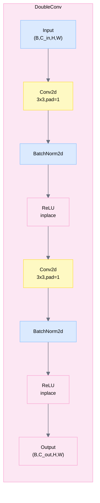

# UNet 完整流程图

## 整体架构 - 端到端流程

```mermaid
%%{init: {'theme':'base', 'themeVariables': {
  'primaryColor':'#dbeafe',
  'primaryTextColor':'#000000',
  'primaryBorderColor':'#93c5fd',
  'secondaryColor':'#fef9c3',
  'secondaryTextColor':'#000000',
  'secondaryBorderColor':'#fde047',
  'tertiaryColor':'#fce7f3',
  'tertiaryTextColor':'#000000',
  'tertiaryBorderColor':'#f9a8d4',
  'lineColor':'#6b7280',
  'textColor':'#000000',
  'fontSize':'10px'
}}}%%
graph LR
    subgraph Input["输入"]
        I1["图像<br/>(B,3,H,W)"]
    end

    subgraph Encoder["编码器"]
        E1["DoubleConv<br/>conv1<br/>(B,64,H,W)"]
        E2["MaxPool2d<br/>pool1"]
        E3["DoubleConv<br/>conv2<br/>(B,128,H/2,W/2)"]
        E4["MaxPool2d<br/>pool2"]
        E5["DoubleConv<br/>conv3<br/>(B,256,H/4,W/4)"]
        E6["MaxPool2d<br/>pool3"]
        E7["DoubleConv<br/>conv4<br/>(B,512,H/8,W/8)"]
        E8["MaxPool2d<br/>pool4"]
    end

    subgraph Bottleneck["瓶颈"]
        B1["DoubleConv<br/>conv5<br/>(B,1024,H/16,W/16)"]
    end

    subgraph Decoder["解码器"]
        D1["ConvTranspose2d<br/>up6"]
        D2["Concat<br/>merge6<br/>(B,1024,H/8,W/8)"]
        D3["DoubleConv<br/>conv6<br/>(B,512,H/8,W/8)"]
        D4["ConvTranspose2d<br/>up7"]
        D5["Concat<br/>merge7<br/>(B,512,H/4,W/4)"]
        D6["DoubleConv<br/>conv7<br/>(B,256,H/4,W/4)"]
        D7["ConvTranspose2d<br/>up8"]
        D8["Concat<br/>merge8<br/>(B,256,H/2,W/2)"]
        D9["DoubleConv<br/>conv8<br/>(B,128,H/2,W/2)"]
        D10["ConvTranspose2d<br/>up9"]
        D11["Concat<br/>merge9<br/>(B,128,H,W)"]
        D12["DoubleConv<br/>conv9<br/>(B,64,H,W)"]
    end

    subgraph Output["输出"]
        O1["Conv2d<br/>conv10<br/>(B,3,H,W)"]
        O2["Sigmoid"]
        O3["分割掩码<br/>(B,3,H,W)"]
    end

    I1 --> E1
    E1 --> E2
    E2 --> E3
    E3 --> E4
    E4 --> E5
    E5 --> E6
    E6 --> E7
    E7 --> E8
    E8 --> B1
    B1 --> D1
    D1 --> D2
    D2 --> D3
    D3 --> D4
    D4 --> D5
    D5 --> D6
    D6 --> D7
    D7 --> D8
    D8 --> D9
    D9 --> D10
    D10 --> D11
    D11 --> D12
    D12 --> O1
    O1 --> O2
    O2 --> O3

    E7 -- "跳跃连接" --> D2
    E5 -- "跳跃连接" --> D5
    E3 -- "跳跃连接" --> D8
    E1 -- "跳跃连接" --> D11

    style I1 fill:#dbeafe,stroke:#93c5fd,color:#000000
    style E1 fill:#fef9c3,stroke:#fde047,color:#000000
    style E3 fill:#fef9c3,stroke:#fde047,color:#000000
    style E5 fill:#fef9c3,stroke:#fde047,color:#000000
    style E7 fill:#fef9c3,stroke:#fde047,color:#000000
    style E2 fill:#fce7f3,stroke:#f9a8d4,color:#000000
    style E4 fill:#fce7f3,stroke:#f9a8d4,color:#000000
    style E6 fill:#fce7f3,stroke:#f9a8d4,color:#000000
    style E8 fill:#fce7f3,stroke:#f9a8d4,color:#000000
    style B1 fill:#fef9c3,stroke:#fde047,color:#000000
    style D1 fill:#fce7f3,stroke:#f9a8d4,color:#000000
    style D2 fill:#fef9c3,stroke:#fde047,color:#000000
    style D3 fill:#fef9c3,stroke:#fde047,color:#000000
    style D4 fill:#fce7f3,stroke:#f9a8d4,color:#000000
    style D5 fill:#fef9c3,stroke:#fde047,color:#000000
    style D6 fill:#fef9c3,stroke:#fde047,color:#000000
    style D7 fill:#fce7f3,stroke:#f9a8d4,color:#000000
    style D8 fill:#fef9c3,stroke:#fde047,color:#000000
    style D9 fill:#fef9c3,stroke:#fde047,color:#000000
    style D10 fill:#fce7f3,stroke:#f9a8d4,color:#000000
    style D11 fill:#fef9c3,stroke:#fde047,color:#000000
    style D12 fill:#fef9c3,stroke:#fde047,color:#000000
    style O1 fill:#fef9c3,stroke:#fde047,color:#000000
    style O2 fill:#fce7f3,stroke:#f9a8d4,color:#000000
    style O3 fill:#fce7f3,stroke:#f9a8d4,color:#000000
```

---

## DoubleConv 块内部结构

---

## 维度变化完整流程

```mermaid
%%{init: {'theme':'base', 'themeVariables': {
  'primaryColor':'#dbeafe',
  'primaryTextColor':'#000000',
  'primaryBorderColor':'#93c5fd',
  'secondaryColor':'#fef9c3',
  'secondaryTextColor':'#000000',
  'secondaryBorderColor':'#fde047',
  'tertiaryColor':'#fce7f3',
  'tertiaryTextColor':'#000000',
  'tertiaryBorderColor':'#f9a8d4',
  'lineColor':'#6b7280',
  'textColor':'#000000',
  'fontSize':'9px'
}}}%%
graph LR
    S1["(B,3,H,W)"]
    S2["(B,64,H,W)"]
    S3["(B,64,H/2,W/2)"]
    S4["(B,128,H/2,W/2)"]
    S5["(B,128,H/4,W/4)"]
    S6["(B,256,H/4,W/4)"]
    S7["(B,256,H/8,W/8)"]
    S8["(B,512,H/8,W/8)"]
    S9["(B,512,H/16,W/16)"]
    S10["(B,1024,H/16,W/16)"]
    S11["(B,512,H/8,W/8)"]
    S12["(B,1024,H/8,W/8)"]
    S13["(B,512,H/8,W/8)"]
    S14["(B,256,H/4,W/4)"]
    S15["(B,512,H/4,W/4)"]
    S16["(B,256,H/4,W/4)"]
    S17["(B,128,H/2,W/2)"]
    S18["(B,256,H/2,W/2)"]
    S19["(B,128,H/2,W/2)"]
    S20["(B,64,H,W)"]
    S21["(B,128,H,W)"]
    S22["(B,64,H,W)"]
    S23["(B,3,H,W)"]
    S24["(B,3,H,W)"]

    S1 -- "conv1" --> S2
    S2 -- "pool1" --> S3
    S3 -- "conv2" --> S4
    S4 -- "pool2" --> S5
    S5 -- "conv3" --> S6
    S6 -- "pool3" --> S7
    S7 -- "conv4" --> S8
    S8 -- "pool4" --> S9
    S9 -- "conv5" --> S10
    S10 -- "up6" --> S11
    S11 -- "cat+conv6" --> S12
    S12 -- "cat+conv6" --> S13
    S13 -- "up7" --> S14
    S14 -- "cat+conv7" --> S15
    S15 -- "cat+conv7" --> S16
    S16 -- "up8" --> S17
    S17 -- "cat+conv8" --> S18
    S18 -- "cat+conv8" --> S19
    S19 -- "up9" --> S20
    S20 -- "cat+conv9" --> S21
    S21 -- "cat+conv9" --> S22
    S22 -- "conv10" --> S23
    S23 -- "sigmoid" --> S24

    S8 -. "skip" .-> S12
    S6 -. "skip" .-> S15
    S4 -. "skip" .-> S18
    S2 -. "skip" .-> S21

    style S1 fill:#dbeafe,stroke:#93c5fd,color:#000000
    style S2 fill:#fef9c3,stroke:#fde047,color:#000000
    style S4 fill:#fef9c3,stroke:#fde047,color:#000000
    style S6 fill:#fef9c3,stroke:#fde047,color:#000000
    style S8 fill:#fef9c3,stroke:#fde047,color:#000000
    style S10 fill:#fef9c3,stroke:#fde047,color:#000000
    style S13 fill:#fef9c3,stroke:#fde047,color:#000000
    style S16 fill:#fef9c3,stroke:#fde047,color:#000000
    style S19 fill:#fef9c3,stroke:#fde047,color:#000000
    style S22 fill:#fef9c3,stroke:#fde047,color:#000000
    style S24 fill:#fce7f3,stroke:#f9a8d4,color:#000000
```

---

## 类名与文件位置映射

| 类名 | 文件路径 | 行号 |
|------|---------|------|
| Unet | C:\Users\junyou.zhang\Desktop\Us\UNet-Camelyon\UNet.py | 23-75 |
| DoubleConv | C:\Users\junyou.zhang\Desktop\Us\UNet-Camelyon\UNet.py | 6-20 |
| Conv2d | torch.nn.Conv2d | PyTorch内置 |
| BatchNorm2d | torch.nn.BatchNorm2d | PyTorch内置 |
| ReLU | torch.nn.ReLU | PyTorch内置 |
| MaxPool2d | torch.nn.MaxPool2d | PyTorch内置 |
| ConvTranspose2d | torch.nn.ConvTranspose2d | PyTorch内置 |
| Sigmoid | torch.nn.Sigmoid | PyTorch内置 |

---

## 模块参数统计

### Encoder

| 层级 | 模块 | 输入通道 | 输出通道 | 参数量 |
|------|------|---------|---------|--------|
| Level 1 | conv1 (DoubleConv) | 3 | 64 | ~38K |
| Level 2 | conv2 (DoubleConv) | 64 | 128 | ~148K |
| Level 3 | conv3 (DoubleConv) | 128 | 256 | ~590K |
| Level 4 | conv4 (DoubleConv) | 256 | 512 | ~2.4M |

### Bottleneck

| 层级 | 模块 | 输入通道 | 输出通道 | 参数量 |
|------|------|---------|---------|--------|
| Bottleneck | conv5 (DoubleConv) | 512 | 1024 | ~9.4M |

### Decoder

| 层级 | 模块 | 输入通道 | 输出通道 | 参数量 |
|------|------|---------|---------|--------|
| Level 1 | up6 + conv6 | 1024 + 512 | 512 | ~9.4M |
| Level 2 | up7 + conv7 | 512 + 256 | 256 | ~2.4M |
| Level 3 | up8 + conv8 | 256 + 128 | 128 | ~590K |
| Level 4 | up9 + conv9 | 128 + 64 | 64 | ~148K |

### Output Head

| 层级 | 模块 | 输入通道 | 输出通道 | 参数量 |
|------|------|---------|---------|--------|
| Output | conv10 | 64 | 3 | ~195 |

**总参数量**: 约 25M (25,000,000)

---

## 数据流关键特征

1. **对称性**: 编码器和解码器具有对称的通道数和空间维度
2. **跳跃连接**: 4个跳跃连接保留高分辨率特征
3. **通道加倍**: 编码器每次下采样时通道数加倍
4. **通道减半**: 解码器每次上采样时通道数减半
5. **空间保持**: 输入和输出空间维度完全相同
6. **瓶颈深度**: 在1/16分辨率处达到最大通道数(1024)

---

## 训练配置

- **损失函数**: BCELoss + DiceLoss
- **优化器**: Adam
- **批次大小**: 6
- **训练轮数**: 200
- **设备**: CUDA:1 或 CPU
- **数据集**: Camelyon16
- **输入通道**: 3 (RGB)
- **输出通道**: 3 (分割类别)

