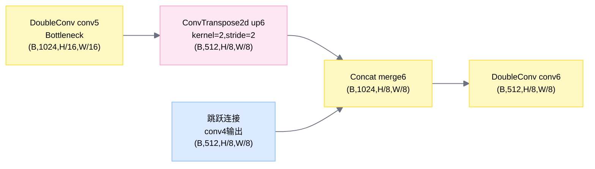
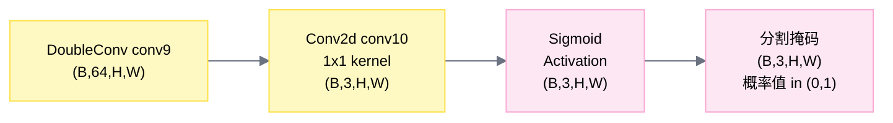

# UNet 详细流程图

## 模型前向流程 (Forward Pass)

```mermaid
%%{init: {'theme':'base', 'themeVariables': {
  'primaryColor':'#dbeafe',
  'primaryTextColor':'#000000',
  'primaryBorderColor':'#93c5fd',
  'secondaryColor':'#fef9c3',
  'secondaryTextColor':'#000000',
  'secondaryBorderColor':'#fde047',
  'tertiaryColor':'#fce7f3',
  'tertiaryTextColor':'#000000',
  'tertiaryBorderColor':'#f9a8d4',
  'lineColor':'#6b7280',
  'textColor':'#000000',
  'fontSize':'12px'
}}}%%
graph LR
    subgraph Input["输入数据"]
        I1["输入图像<br/>(B,3,H,W)"]
    end

    subgraph Encoder["编码器路径"]
        E1["DoubleConv<br/>conv1<br/>(B,64,H,W)"]
        E2["MaxPool2d<br/>pool1<br/>stride=2"]
        E3["DoubleConv<br/>conv2<br/>(B,128,H/2,W/2)"]
        E4["MaxPool2d<br/>pool2<br/>stride=2"]
        E5["DoubleConv<br/>conv3<br/>(B,256,H/4,W/4)"]
        E6["MaxPool2d<br/>pool3<br/>stride=2"]
        E7["DoubleConv<br/>conv4<br/>(B,512,H/8,W/8)"]
        E8["MaxPool2d<br/>pool4<br/>stride=2"]
    end

    subgraph Bottleneck["瓶颈层"]
        B1["DoubleConv<br/>conv5<br/>(B,1024,H/16,W/16)"]
    end

    subgraph Decoder["解码器路径"]
        D1["ConvTranspose2d<br/>up6<br/>(B,512,H/8,W/8)"]
        D2["Concat + DoubleConv<br/>conv6<br/>(B,512,H/8,W/8)"]
        D3["ConvTranspose2d<br/>up7<br/>(B,256,H/4,W/4)"]
        D4["Concat + DoubleConv<br/>conv7<br/>(B,256,H/4,W/4)"]
        D5["ConvTranspose2d<br/>up8<br/>(B,128,H/2,W/2)"]
        D6["Concat + DoubleConv<br/>conv8<br/>(B,128,H/2,W/2)"]
        D7["ConvTranspose2d<br/>up9<br/>(B,64,H,W)"]
        D8["Concat + DoubleConv<br/>conv9<br/>(B,64,H,W)"]
    end

    subgraph Output["输出层"]
        O1["Conv2d 1x1<br/>conv10<br/>(B,3,H,W)"]
        O2["Sigmoid<br/>激活函数"]
        O3["分割掩码<br/>(B,3,H,W)"]
    end

    I1 --> E1
    E1 --> E2
    E2 --> E3
    E3 --> E4
    E4 --> E5
    E5 --> E6
    E6 --> E7
    E7 --> E8
    E8 --> B1

    B1 --> D1
    D1 --> D2
    D2 --> D3
    D3 --> D4
    D4 --> D5
    D5 --> D6
    D6 --> D7
    D7 --> D8
    D8 --> O1
    O1 --> O2
    O2 --> O3

    style I1 fill:#dbeafe,stroke:#93c5fd,color:#000000
    style E1 fill:#fef9c3,stroke:#fde047,color:#000000
    style E3 fill:#fef9c3,stroke:#fde047,color:#000000
    style E5 fill:#fef9c3,stroke:#fde047,color:#000000
    style E7 fill:#fef9c3,stroke:#fde047,color:#000000
    style E2 fill:#fce7f3,stroke:#f9a8d4,color:#000000
    style E4 fill:#fce7f3,stroke:#f9a8d4,color:#000000
    style E6 fill:#fce7f3,stroke:#f9a8d4,color:#000000
    style E8 fill:#fce7f3,stroke:#f9a8d4,color:#000000
    style B1 fill:#fef9c3,stroke:#fde047,color:#000000
    style D1 fill:#fce7f3,stroke:#f9a8d4,color:#000000
    style D2 fill:#fef9c3,stroke:#fde047,color:#000000
    style D3 fill:#fce7f3,stroke:#f9a8d4,color:#000000
    style D4 fill:#fef9c3,stroke:#fde047,color:#000000
    style D5 fill:#fce7f3,stroke:#f9a8d4,color:#000000
    style D6 fill:#fef9c3,stroke:#fde047,color:#000000
    style D7 fill:#fce7f3,stroke:#f9a8d4,color:#000000
    style D8 fill:#fef9c3,stroke:#fde047,color:#000000
    style O1 fill:#fef9c3,stroke:#fde047,color:#000000
    style O2 fill:#fce7f3,stroke:#f9a8d4,color:#000000
    style O3 fill:#fce7f3,stroke:#f9a8d4,color:#000000
```

---

## DoubleConv 块详细流程

```mermaid
%%{init: {'theme':'base', 'themeVariables': {
  'primaryColor':'#dbeafe',
  'primaryTextColor':'#000000',
  'primaryBorderColor':'#93c5fd',
  'secondaryColor':'#fef9c3',
  'secondaryTextColor':'#000000',
  'secondaryBorderColor':'#fde047',
  'tertiaryColor':'#fce7f3',
  'tertiaryTextColor':'#000000',
  'tertiaryBorderColor':'#f9a8d4',
  'lineColor':'#6b7280',
  'textColor':'#000000',
  'fontSize':'12px'
}}}%%
graph LR
    Input["输入<br/>(B,C_in,H,W)"]

    Conv1["Conv2d<br/>3x3 kernel<br/>padding=1<br/>padding_mode=replicate"]
    BN1["BatchNorm2d<br/>(B,C_out,H,W)"]
    ReLU1["ReLU<br/>inplace=true"]

    Conv2["Conv2d<br/>3x3 kernel<br/>padding=1<br/>padding_mode=replicate"]
    BN2["BatchNorm2d<br/>(B,C_out,H,W)"]
    ReLU2["ReLU<br/>inplace=true"]

    Output["输出<br/>(B,C_out,H,W)"]

    Input --> Conv1
    Conv1 --> BN1
    BN1 --> ReLU1
    ReLU1 --> Conv2
    Conv2 --> BN2
    BN2 --> ReLU2
    ReLU2 --> Output

    style Input fill:#dbeafe,stroke:#93c5fd,color:#000000
    style Conv1 fill:#fef9c3,stroke:#fde047,color:#000000
    style Conv2 fill:#fef9c3,stroke:#fde047,color:#000000
    style BN1 fill:#dbeafe,stroke:#93c5fd,color:#000000
    style BN2 fill:#dbeafe,stroke:#93c5fd,color:#000000
    style ReLU1 fill:#fce7f3,stroke:#f9a8d4,color:#000000
    style ReLU2 fill:#fce7f3,stroke:#f9a8d4,color:#000000
    style Output fill:#fce7f3,stroke:#f9a8d4,color:#000000
```

---

## 编码器阶段详细流程

```mermaid
%%{init: {'theme':'base', 'themeVariables': {
  'primaryColor':'#dbeafe',
  'primaryTextColor':'#000000',
  'primaryBorderColor':'#93c5fd',
  'secondaryColor':'#fef9c3',
  'secondaryTextColor':'#000000',
  'secondaryBorderColor':'#fde047',
  'tertiaryColor':'#fce7f3',
  'tertiaryTextColor':'#000000',
  'tertiaryBorderColor':'#f9a8d4',
  'lineColor':'#6b7280',
  'textColor':'#000000',
  'fontSize':'11px'
}}}%%
graph LR
    I["输入图像<br/>(B,3,H,W)"]

    C1["DoubleConv conv1<br/>(B,64,H,W)"]
    P1["MaxPool2d pool1<br/>2x2,stride=2<br/>(B,64,H/2,W/2)"]

    C2["DoubleConv conv2<br/>(B,128,H/2,W/2)"]
    P2["MaxPool2d pool2<br/>2x2,stride=2<br/>(B,128,H/4,W/4)"]

    C3["DoubleConv conv3<br/>(B,256,H/4,W/4)"]
    P3["MaxPool2d pool3<br/>2x2,stride=2<br/>(B,256,H/8,W/8)"]

    C4["DoubleConv conv4<br/>(B,512,H/8,W/8)"]
    P4["MaxPool2d pool4<br/>2x2,stride=2<br/>(B,512,H/16,W/16)"]

    I --> C1
    C1 --> P1
    P1 --> C2
    C2 --> P2
    P2 --> C3
    C3 --> P3
    P3 --> C4
    C4 --> P4

    style I fill:#dbeafe,stroke:#93c5fd,color:#000000
    style C1 fill:#fef9c3,stroke:#fde047,color:#000000
    style C2 fill:#fef9c3,stroke:#fde047,color:#000000
    style C3 fill:#fef9c3,stroke:#fde047,color:#000000
    style C4 fill:#fef9c3,stroke:#fde047,color:#000000
    style P1 fill:#fce7f3,stroke:#f9a8d4,color:#000000
    style P2 fill:#fce7f3,stroke:#f9a8d4,color:#000000
    style P3 fill:#fce7f3,stroke:#f9a8d4,color:#000000
    style P4 fill:#fce7f3,stroke:#f9a8d4,color:#000000
```

---

## 解码器阶段详细流程 (第一层级)

---

## 解码器阶段详细流程 (第二至四层级)

```mermaid
%%{init: {'theme':'base', 'themeVariables': {
  'primaryColor':'#dbeafe',
  'primaryTextColor':'#000000',
  'primaryBorderColor':'#93c5fd',
  'secondaryColor':'#fef9c3',
  'secondaryTextColor':'#000000',
  'secondaryBorderColor':'#fde047',
  'tertiaryColor':'#fce7f3',
  'tertiaryTextColor':'#000000',
  'tertiaryBorderColor':'#f9a8d4',
  'lineColor':'#6b7280',
  'textColor':'#000000',
  'fontSize':'10px'
}}}%%
graph LR
    C6["conv6<br/>(B,512,H/8,W/8)"]

    UP7["up7<br/>(B,256,H/4,W/4)"]
    SK3["conv3<br/>(B,256,H/4,W/4)"]
    CAT7["merge7<br/>(B,512,H/4,W/4)"]
    C7["conv7<br/>(B,256,H/4,W/4)"]

    UP8["up8<br/>(B,128,H/2,W/2)"]
    SK2["conv2<br/>(B,128,H/2,W/2)"]
    CAT8["merge8<br/>(B,256,H/2,W/2)"]
    C8["conv8<br/>(B,128,H/2,W/2)"]

    UP9["up9<br/>(B,64,H,W)"]
    SK1["conv1<br/>(B,64,H,W)"]
    CAT9["merge9<br/>(B,128,H,W)"]
    C9["conv9<br/>(B,64,H,W)"]

    C6 --> UP7
    UP7 --> CAT7
    SK3 --> CAT7
    CAT7 --> C7
    C7 --> UP8
    UP8 --> CAT8
    SK2 --> CAT8
    CAT8 --> C8
    C8 --> UP9
    UP9 --> CAT9
    SK1 --> CAT9
    CAT9 --> C9

    style C6 fill:#fef9c3,stroke:#fde047,color:#000000
    style C7 fill:#fef9c3,stroke:#fde047,color:#000000
    style C8 fill:#fef9c3,stroke:#fde047,color:#000000
    style C9 fill:#fef9c3,stroke:#fde047,color:#000000
    style UP7 fill:#fce7f3,stroke:#f9a8d4,color:#000000
    style UP8 fill:#fce7f3,stroke:#f9a8d4,color:#000000
    style UP9 fill:#fce7f3,stroke:#f9a8d4,color:#000000
    style SK1 fill:#dbeafe,stroke:#93c5fd,color:#000000
    style SK2 fill:#dbeafe,stroke:#93c5fd,color:#000000
    style SK3 fill:#dbeafe,stroke:#93c5fd,color:#000000
    style CAT7 fill:#fef9c3,stroke:#fde047,color:#000000
    style CAT8 fill:#fef9c3,stroke:#fde047,color:#000000
    style CAT9 fill:#fef9c3,stroke:#fde047,color:#000000
```

---

## 输出头详细流程

---

## 维度变化总结表

| 阶段 | 层级 | 类名 | 输入维度 | 输出维度 | 操作 |
|------|------|------|---------|---------|------|
| 编码器1 | conv1 | DoubleConv | (B,3,H,W) | (B,64,H,W) | 双卷积 |
| 编码器1 | pool1 | MaxPool2d | (B,64,H,W) | (B,64,H/2,W/2) | 下采样 |
| 编码器2 | conv2 | DoubleConv | (B,64,H/2,W/2) | (B,128,H/2,W/2) | 双卷积 |
| 编码器2 | pool2 | MaxPool2d | (B,128,H/2,W/2) | (B,128,H/4,W/4) | 下采样 |
| 编码器3 | conv3 | DoubleConv | (B,128,H/4,W/4) | (B,256,H/4,W/4) | 双卷积 |
| 编码器3 | pool3 | MaxPool2d | (B,256,H/4,W/4) | (B,256,H/8,W/8) | 下采样 |
| 编码器4 | conv4 | DoubleConv | (B,256,H/8,W/8) | (B,512,H/8,W/8) | 双卷积 |
| 编码器4 | pool4 | MaxPool2d | (B,512,H/8,W/8) | (B,512,H/16,W/16) | 下采样 |
| 瓶颈 | conv5 | DoubleConv | (B,512,H/16,W/16) | (B,1024,H/16,W/16) | 双卷积 |
| 解码器1 | up6 | ConvTranspose2d | (B,1024,H/16,W/16) | (B,512,H/8,W/8) | 上采样 |
| 解码器1 | merge6 | Concat | 2×(B,512,H/8,W/8) | (B,1024,H/8,W/8) | 跳跃连接 |
| 解码器1 | conv6 | DoubleConv | (B,1024,H/8,W/8) | (B,512,H/8,W/8) | 双卷积 |
| 解码器2 | up7 | ConvTranspose2d | (B,512,H/8,W/8) | (B,256,H/4,W/4) | 上采样 |
| 解码器2 | merge7 | Concat | 2×(B,256,H/4,W/4) | (B,512,H/4,W/4) | 跳跃连接 |
| 解码器2 | conv7 | DoubleConv | (B,512,H/4,W/4) | (B,256,H/4,W/4) | 双卷积 |
| 解码器3 | up8 | ConvTranspose2d | (B,256,H/4,W/4) | (B,128,H/2,W/2) | 上采样 |
| 解码器3 | merge8 | Concat | 2×(B,128,H/2,W/2) | (B,256,H/2,W/2) | 跳跃连接 |
| 解码器3 | conv8 | DoubleConv | (B,256,H/2,W/2) | (B,128,H/2,W/2) | 双卷积 |
| 解码器4 | up9 | ConvTranspose2d | (B,128,H/2,W/2) | (B,64,H,W) | 上采样 |
| 解码器4 | merge9 | Concat | 2×(B,64,H,W) | (B,128,H,W) | 跳跃连接 |
| 解码器4 | conv9 | DoubleConv | (B,128,H,W) | (B,64,H,W) | 双卷积 |
| 输出 | conv10 | Conv2d | (B,64,H,W) | (B,3,H,W) | 1x1卷积 |
| 输出 | Sigmoid | Sigmoid | (B,3,H,W) | (B,3,H,W) | 激活函数 |

