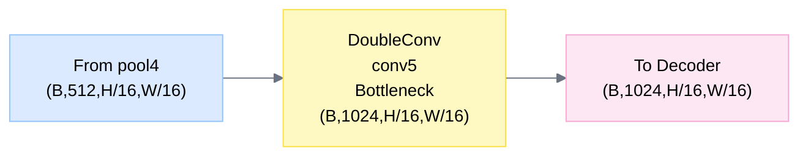
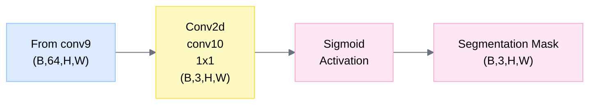

# UNet Architecture Overview

## Model: Unet
**File**: C:\Users\junyou.zhang\Desktop\Us\UNet-Camelyon\UNet.py:23-75

**Description**: U-Net architecture for semantic segmentation with encoder-decoder structure and skip connections

---

## Architecture Paradigm
- **Type**: Encoder-Decoder with Skip Connections
- **Input**: 3-channel images (RGB)
- **Output**: 3-channel segmentation masks with sigmoid activation

---

## 1. DoubleConv Block

```mermaid
%%{init: {'theme':'base', 'themeVariables': {
  'primaryColor':'#dbeafe',
  'primaryTextColor':'#000000',
  'primaryBorderColor':'#93c5fd',
  'secondaryColor':'#fef9c3',
  'secondaryTextColor':'#000000',
  'secondaryBorderColor':'#fde047',
  'tertiaryColor':'#fce7f3',
  'tertiaryTextColor':'#000000',
  'tertiaryBorderColor':'#f9a8d4',
  'lineColor':'#6b7280',
  'textColor':'#000000',
  'fontSize':'14px'
}}}%%
graph LR
    Input["Input<br/>(B,C_in,H,W)"]
    Conv1["Conv2d<br/>3x3<br/>pad=1"]
    BN1["BatchNorm2d"]
    ReLU1["ReLU"]
    Conv2["Conv2d<br/>3x3<br/>pad=1"]
    BN2["BatchNorm2d"]
    ReLU2["ReLU"]
    Output["Output<br/>(B,C_out,H,W)"]

    Input --> Conv1
    Conv1 --> BN1
    BN1 --> ReLU1
    ReLU1 --> Conv2
    Conv2 --> BN2
    BN2 --> ReLU2
    ReLU2 --> Output

    style Input fill:#dbeafe,stroke:#93c5fd,color:#000000
    style Output fill:#fce7f3,stroke:#f9a8d4,color:#000000
    style Conv1 fill:#fef9c3,stroke:#fde047,color:#000000
    style Conv2 fill:#fef9c3,stroke:#fde047,color:#000000
    style BN1 fill:#dbeafe,stroke:#93c5fd,color:#000000
    style BN2 fill:#dbeafe,stroke:#93c5fd,color:#000000
    style ReLU1 fill:#fce7f3,stroke:#f9a8d4,color:#000000
    style ReLU2 fill:#fce7f3,stroke:#f9a8d4,color:#000000
```

**Class**: DoubleConv
**File**: C:\Users\junyou.zhang\Desktop\Us\UNet-Camelyon\UNet.py:6-20

---

## 2. Encoder Path

```mermaid
%%{init: {'theme':'base', 'themeVariables': {
  'primaryColor':'#dbeafe',
  'primaryTextColor':'#000000',
  'primaryBorderColor':'#93c5fd',
  'secondaryColor':'#fef9c3',
  'secondaryTextColor':'#000000',
  'secondaryBorderColor':'#fde047',
  'tertiaryColor':'#fce7f3',
  'tertiaryTextColor':'#000000',
  'tertiaryBorderColor':'#f9a8d4',
  'lineColor':'#6b7280',
  'textColor':'#000000',
  'fontSize':'14px'
}}}%%
graph LR
    Input["Input Image<br/>(B,3,H,W)"]
    C1["DoubleConv<br/>conv1<br/>(B,64,H,W)"]
    P1["MaxPool2d<br/>pool1<br/>(B,64,H/2,W/2)"]
    C2["DoubleConv<br/>conv2<br/>(B,128,H/2,W/2)"]
    P2["MaxPool2d<br/>pool2<br/>(B,128,H/4,W/4)"]
    C3["DoubleConv<br/>conv3<br/>(B,256,H/4,W/4)"]
    P3["MaxPool2d<br/>pool3<br/>(B,256,H/8,W/8)"]
    C4["DoubleConv<br/>conv4<br/>(B,512,H/8,W/8)"]
    P4["MaxPool2d<br/>pool4<br/>(B,512,H/16,W/16)"]

    Input --> C1
    C1 --> P1
    P1 --> C2
    C2 --> P2
    P2 --> C3
    C3 --> P3
    P3 --> C4
    C4 --> P4

    style Input fill:#dbeafe,stroke:#93c5fd,color:#000000
    style C1 fill:#fef9c3,stroke:#fde047,color:#000000
    style C2 fill:#fef9c3,stroke:#fde047,color:#000000
    style C3 fill:#fef9c3,stroke:#fde047,color:#000000
    style C4 fill:#fef9c3,stroke:#fde047,color:#000000
    style P1 fill:#fce7f3,stroke:#f9a8d4,color:#000000
    style P2 fill:#fce7f3,stroke:#f9a8d4,color:#000000
    style P3 fill:#fce7f3,stroke:#f9a8d4,color:#000000
    style P4 fill:#fce7f3,stroke:#f9a8d4,color:#000000
```

---

## 3. Bottleneck

**Class**: DoubleConv
**File**: C:\Users\junyou.zhang\Desktop\Us\UNet-Camelyon\UNet.py:6-20

---

## 4. Decoder Path with Skip Connections

```mermaid
%%{init: {'theme':'base', 'themeVariables': {
  'primaryColor':'#dbeafe',
  'primaryTextColor':'#000000',
  'primaryBorderColor':'#93c5fd',
  'secondaryColor':'#fef9c3',
  'secondaryTextColor':'#000000',
  'secondaryBorderColor':'#fde047',
  'tertiaryColor':'#fce7f3',
  'tertiaryTextColor':'#000000',
  'tertiaryBorderColor':'#f9a8d4',
  'lineColor':'#6b7280',
  'textColor':'#000000',
  'fontSize':'14px'
}}}%%
graph LR
    Input["From conv5<br/>(B,1024,H/16,W/16)"]

    U6["ConvTranspose2d<br/>up6<br/>(B,512,H/8,W/8)"]
    Skip4["Skip: conv4<br/>(B,512,H/8,W/8)"]
    M6["Concat<br/>merge6<br/>(B,1024,H/8,W/8)"]
    C6["DoubleConv<br/>conv6<br/>(B,512,H/8,W/8)"]

    U7["ConvTranspose2d<br/>up7<br/>(B,256,H/4,W/4)"]
    Skip3["Skip: conv3<br/>(B,256,H/4,W/4)"]
    M7["Concat<br/>merge7<br/>(B,512,H/4,W/4)"]
    C7["DoubleConv<br/>conv7<br/>(B,256,H/4,W/4)"]

    U8["ConvTranspose2d<br/>up8<br/>(B,128,H/2,W/2)"]
    Skip2["Skip: conv2<br/>(B,128,H/2,W/2)"]
    M8["Concat<br/>merge8<br/>(B,256,H/2,W/2)"]
    C8["DoubleConv<br/>conv8<br/>(B,128,H/2,W/2)"]

    U9["ConvTranspose2d<br/>up9<br/>(B,64,H,W)"]
    Skip1["Skip: conv1<br/>(B,64,H,W)"]
    M9["Concat<br/>merge9<br/>(B,128,H,W)"]
    C9["DoubleConv<br/>conv9<br/>(B,64,H,W)"]

    Input --> U6
    U6 --> M6
    Skip4 --> M6
    M6 --> C6
    C6 --> U7
    U7 --> M7
    Skip3 --> M7
    M7 --> C7
    C7 --> U8
    U8 --> M8
    Skip2 --> M8
    M8 --> C8
    C8 --> U9
    U9 --> M9
    Skip1 --> M9
    M9 --> C9

    style Input fill:#dbeafe,stroke:#93c5fd,color:#000000
    style U6 fill:#fce7f3,stroke:#f9a8d4,color:#000000
    style U7 fill:#fce7f3,stroke:#f9a8d4,color:#000000
    style U8 fill:#fce7f3,stroke:#f9a8d4,color:#000000
    style U9 fill:#fce7f3,stroke:#f9a8d4,color:#000000
    style Skip1 fill:#dbeafe,stroke:#93c5fd,color:#000000
    style Skip2 fill:#dbeafe,stroke:#93c5fd,color:#000000
    style Skip3 fill:#dbeafe,stroke:#93c5fd,color:#000000
    style Skip4 fill:#dbeafe,stroke:#93c5fd,color:#000000
    style M6 fill:#fef9c3,stroke:#fde047,color:#000000
    style M7 fill:#fef9c3,stroke:#fde047,color:#000000
    style M8 fill:#fef9c3,stroke:#fde047,color:#000000
    style M9 fill:#fef9c3,stroke:#fde047,color:#000000
    style C6 fill:#fef9c3,stroke:#fde047,color:#000000
    style C7 fill:#fef9c3,stroke:#fde047,color:#000000
    style C8 fill:#fef9c3,stroke:#fde047,color:#000000
    style C9 fill:#fef9c3,stroke:#fde047,color:#000000
```

---

## 5. Output Head

---

## Key Parameters

- **Input Channels**: 3 (RGB)
- **Output Channels**: 3 (Segmentation classes)
- **Encoder Channels**: [64, 128, 256, 512, 1024]
- **Decoder Channels**: [512, 256, 128, 64]
- **Pooling**: MaxPool2d (kernel=2, stride=2)
- **Upsampling**: ConvTranspose2d (kernel=2, stride=2)
- **Convolution**: 3x3 kernels with replicate padding
- **Activation**: ReLU (encoder/decoder), Sigmoid (output)

---

## Training Configuration

- **Loss Function**: BCELoss + DiceLoss
- **Optimizer**: Adam
- **Batch Size**: 6
- **Epochs**: 200
- **Device**: cuda:1 or cpu

---

## Notes

1. Classic U-Net architecture with symmetric encoder-decoder structure
2. Skip connections preserve spatial information from encoder to decoder
3. Uses replicate padding to handle border effects
4. Batch normalization after each convolution for training stability
5. Sigmoid activation enables multi-class segmentation (non-mutually exclusive)
6. Input and output spatial dimensions are identical
7. Bottleneck operates at 1/16 resolution with 1024 channels
